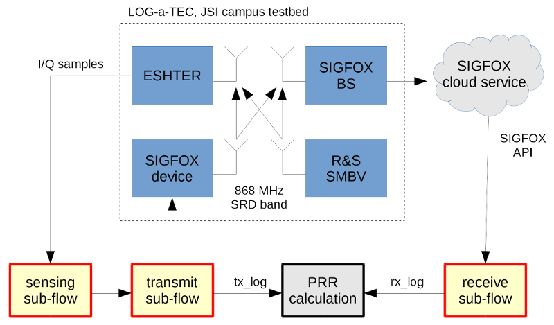

# eWINE project - SIGFOX toolbox

This repository contains the SIGFOX experimentation toolbox developed in the
Horizon 2020 [eWINE project](https://ewine-project.eu/). The toolbox allows for
rapid development of experiments involving Low-power wide-area networks
(LP-WAN) and ultra-narrowband (UNB) technology.

Most components can be used with a visual editor and a flow-based programming
approach in the Node-RED tool. They have been developed for use with equipment
in the [LOG-a-TEC testbed](http://log-a-tec.eu/) and the
[SIGFOX](http://www.sigfox.com/) network, although some may find a wider use.

Note that some components are not present in the public repository due to a
non-disclosure agreement.

## Installation instructions

These instructions assume a reasonably up-to-date Linux system with a Python
3.x interpreter already installed.

### Node-RED

See [installation
section](http://nodered.org/docs/getting-started/installation) in the Node-RED
documentation. Some components in the repository require that Node-RED is
installed under your home directory, in the `~/node_modules/node-red` directory.

Please note that installing Node-RED on an Internet-connected computer will by
default enable anyone to run arbitrary code on your computer. This is a
security risk. **Reading the [security
section](http://nodered.org/docs/security) of the manual is highly recommended
before proceeding.**

### Python virtual environment

It is recommended that a clean Python virtual environment is made before
installing individual Python packages contained in this repository. See
[Creation of virtual environments](https://docs.python.org/3/library/venv.html)
for details.

In brief, you can create a new environment by running the following commands in
a terminal:

    $ cd sigfox-toolbox
    $ export PYTHONPATH=
    $ python3 -mvenv venv
    $ . venv/bin/activate
    $ pip install -U pip

Then, in each new terminal you wish to use the Python components, run:

    $ cd sigfox-toolbox
    $ . venv/bin/activate

## Contents

See `README.md` files in individual sub-directories for details and
installation instructions.

 *  `node-red-python` - Support for Node-RED Python blocks.

 *  `node-red-spectrum-sensing` - Node-RED blocks for spectrum sensing.

 *  `node-red-sigfox-web-api` - Node-RED blocks for communicating with the
    SIGFOX backend API.

 *  `node-red-visualization` - Real-time visualization block for Node-RED
    flows.

 *  `vesna-sfxlib-rpc-firmware` - Firmware for running the proprietary SIGFOX
    MAC protocol library on a VESNA sensor node over a remote-procedure call
    interface.

 *  `flow-keyapp` - Node-RED flow for controlling the SIGFOX KeyApp device.

 *  `flow-packet-loss` - Node-RED flow for measuring packet loss in a SIGFOX
    network.

 *  `sigfox-usrp-phy` - Physical layer implementation of the SIGFOX protocol
    using GNU Radio and a USRP N200 device, with a related Node-RED block.
    **(Not in public repository)**

 *  `sigfox-test-device` - Full software implementation of a SIGFOX modem
    usable from Node-RED. **(Not in public repository)**

## License

See `README.md` files in individual sub-directories for details.

The research leading to these results has received funding from the European
Horizon 2020 Programme project eWINE under grant agreement No. 688116.
